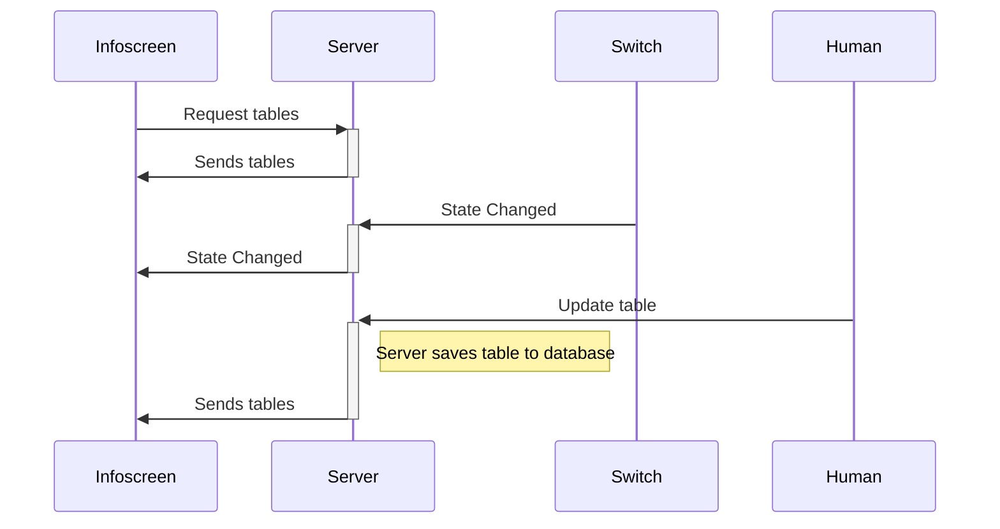


# Infoscreen Documentation
[Git Repository](https://github.com/Snuuson/Infoscreen2023.git)

## Server 

### Overview
##### OS
- RaspberryPi OS (**64bit**)
##### NodeJS Packages used
- Express (Webserver)
- WS (Websockets)
- SQLite3 (Database)
- OnOff (GPIO pins)
- For a complete list see: `Infoscreen2023/Server/package.json`
### Details and Configuration
#### OS configuration
- Make sure to install 64bit version
-- Used *Raspberry Pi Imager* 
-- Set Hostname and Username to  "Infoscreen" and Password to "1234"
-- Turn on AutoLogin in Raspberry Pi Configuration (UI)
- run: `sudo apt-get update && sudo apt-get upgrade`
- install nodejs: `sudo apt-get install nodejs`
- install npm: `sudo apt-get install npm`
#### Webserver Installation
Project should be cloned to `/home/Infoscreen/`([Git Repository](https://github.com/Snuuson/Infoscreen2023.git))
1. Change directory to `cd /home/Infoscreen/Infoscreen2023/Server`
2. run `npm i` to install nodejs packages
3. run `npm run build-dev` to build the project (see `package.json` for build details) 
4. run `node dist/WebServer.js` to start the WebServer 
#### Set Server IP static
-Open `/etc/dhcpcd.conf` and insert:
```
interface eth0
static_routers=192.168.1.1
static domain_name_servers=192.168.1.1
static ip_address=192.168.1.2/24
```


#### Run Chromium Browser on startup
- To hide the mouse cursor install `sudo apt-get install unclutter`
- Create file at `~/.config/lxsession/LXDE-pi/autostart` without sudo (belongs to the user)
- Insert:
 ```
@unclutter -idle 0.1 -root
@xscreensaver -no-splash		#Turns the screensaver off
@xset s off						#Disable screen saver blanking
@xset -dpms						#Display Power Management Signaling off
@xset s noblank					#Turn screen blanking off(black screen but display on)
@chromium-browser --incognito --kiosk http://localhost:3000/updateBeichtdienst.html  # load chromium after boot and open the website in full screen mode
```
#### Run Webserver on startup
- Create System Service [StackOverflow](https://stackoverflow.com/questions/60100830/how-should-i-start-a-node-js-script-automatically)
-- Create file in `/etc/systemd/system`  with with the `.service`  extension
--With file contents:
```
[Unit]
Description=Starts Webserver

[Install]
WantedBy=multi-user.target

[Service]
Type=simple
Restart=always
RestartSec= 10
WorkingDirectory=/home/Infoscreen/Infoscreen2023/Server/
ExecStart= node /home/Infoscreen/Infoscreen2023/Server/dist/WebServer.js
```
- Enable: `systemctl enable <your_service_name>.service`

## Client (Infoscreen Anzeige)
### Overview
##### OS
- RaspberryPi OS (**64bit**)
### Details and Configuration
#### OS configuration
- Make sure to install 64bit version
-- Used *Raspberry Pi Imager* 
-- Set Hostname and Username to  "Infoscreen" and Password to "1234"
-- Turn on AutoLogin in Raspberry Pi Configuration (UI)
- run: `sudo apt-get update && sudo apt-get upgrade`
- To hide the mouse cursor install `sudo apt-get install unclutter`

#### Set IP static
-Open `/etc/dhcpcd.conf` and insert:
```
interface eth0
static_routers=192.168.1.1
static domain_name_servers=192.168.1.1
static ip_address=192.168.1.3/24
```

#### Run Chromium Browser on Startup and Set AlwaysOn Display
- Create file at `~/.config/lxsession/LXDE-pi/autostart` without sudo (belongs to the user)
- Insert:
 ```
@unclutter -idle 0.1 -root
@xscreensaver -no-splash		#Turns the screensaver off
@xset s off						#Disable screen saver blanking
@xset -dpms						#Display Power Management Signaling off
@xset s noblank					#Turn screen blanking off(black screen but display on)
@chromium-browser --incognito --kiosk http://192.168.1.2:3000/Beichtdienst.html  # load chromium after boot and open the website in full screen mode
```
## Sequence Diagram




