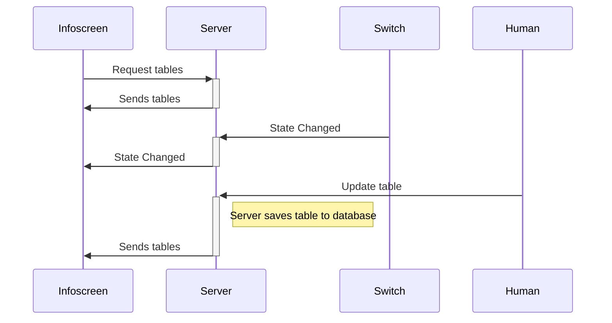


# Infoscreen Documentation
[Git Repository](https://github.com/Snuuson/Infoscreen2023.git)

## Server 

### Overview
##### OS
- RaspberryPi OS (**64bit**)
##### NodeJS Packages used
- Express (Webserver)
- WS (Websockets)
- SQLite3 (Database)
- OnOff (GPIO pins)
- For a complete list see: `Infoscreen2023/Server/package.json`
### Details and Configuration
#### OS configuration
- Make sure to install 64bit version
- Set Hostname and Username to  "Infoscreen"
- run: `sudo apt-get update && sudo apt-get upgrade`
- install nodejs: `sudo apt-get install nodejs`
- install npm: `sudo apt-get install npm`
#### Webserver Installtion
Project should be cloned to `/home/Infoscreen/`([Git Repository](https://github.com/Snuuson/Infoscreen2023.git))
 1. Change directory to `cd /home/Infoscreen/Infoscreen2023/Server`
2. run `npm i` to install nodejs packages
3. run `npm run build-dev` to build the project (see `package.json` for build details) 
4. run `node dist/WebServer.js` to start the WebServer 
#### Run Webserver on startup
- Create System Service [StackOverflow](https://stackoverflow.com/questions/60100830/how-should-i-start-a-node-js-script-automatically)
-- Create file in `/etc/systemd/system`  with with the `.service`  extension
--With file contents:
```
[Unit]
Description=Starts Webserver

[Install]
WantedBy=multi-user.target

[Service]
Type=simple
Restart=always
RestartSec= 10
WorkingDirectory=/home/Infoscreen/Infoscreen2023/Server/
ExecStart= node /home/Infoscreen/Infoscreen2023/Server/dist/WebServer.js
```
- Enable: `systemctl enable <your_service_name>.service`
## Client (Infoscreen Anzeige)
## Sequence Diagram




